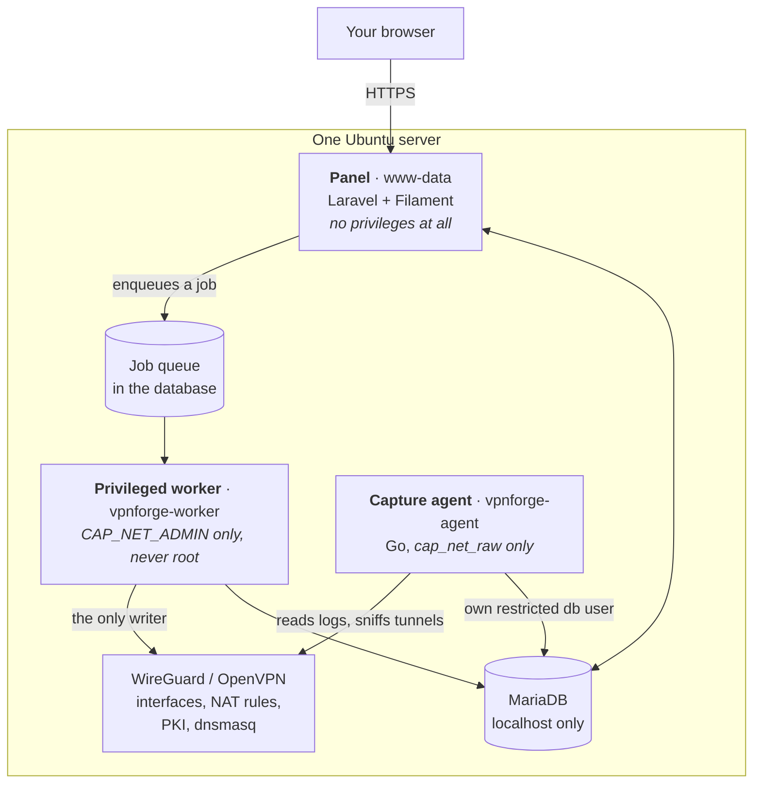
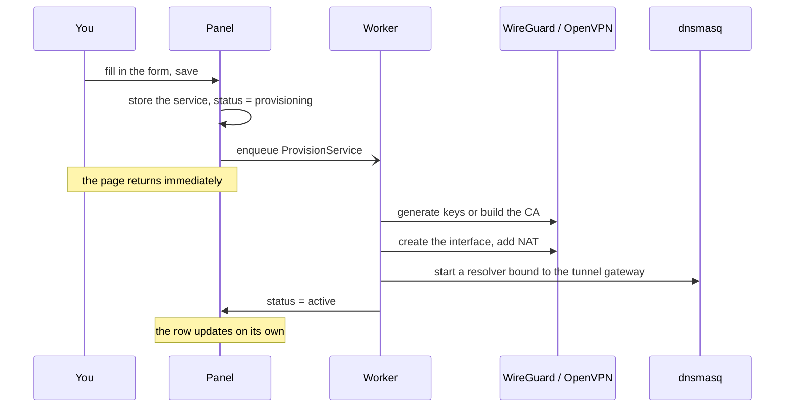
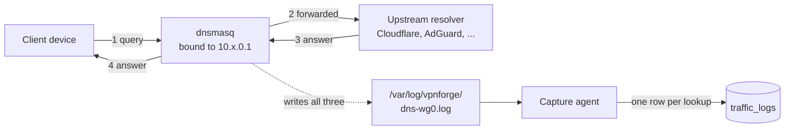
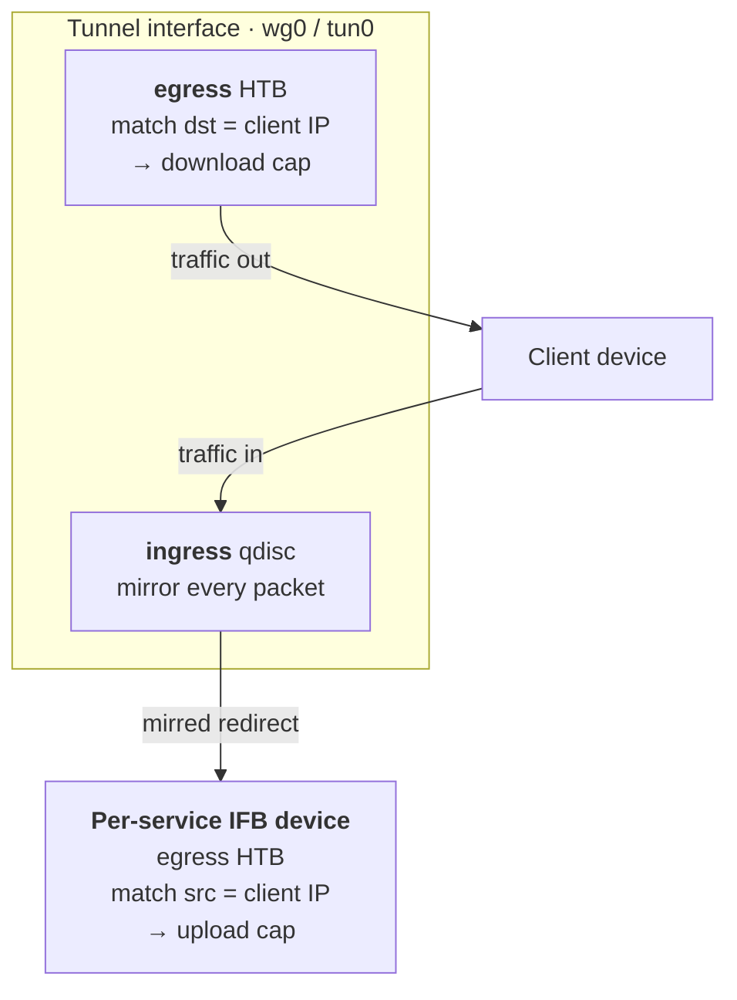
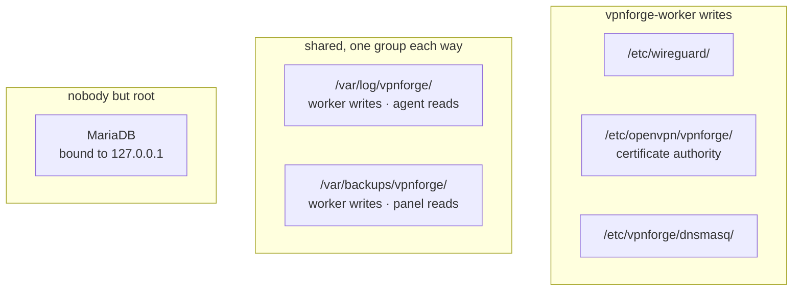

<div align="center">

# vpn-forge

**Run your own WireGuard and OpenVPN servers from one clean panel.**

Independent VPN services, users per service, live connection and bandwidth stats,
DNS-level visibility into what was visited, per-user speed limits, expiry dates
and traffic allowances, one-time config links, PDF reports, and one-click backups
— all self-hosted, on one Ubuntu box.

[](LICENSE)
[](composer.json)
[](composer.json)
[](composer.json)
[](#quick-start)
[](#)
[](#)
[](#)

**100% open source.** MIT licensed, no paid tier, no telemetry, no phone-home,
no account required. Everything it does happens on your server.

</div>

---

<div align="center">

|  |  |  |
|:--|:--|:--|
| 🔀 **Two protocols** | 👥 **Users per service** | 📊 **Live stats** |
| 🌐 **DNS visibility & blocklists** | 🕘 **Access hours** | 🚦 **Per-user speed limits** |
| 🔗 **One-time config links** | 🔔 **Discord / Telegram / ntfy / email alerts** | 🧾 **PDF reports** |
| 💾 **Auto + offsite backups** | 🔐 **2FA + panel IP allowlist** | 🌍 **6 languages** |

</div>

---

## Contents

- [What you get](#what-you-get)
- [How it works](#how-it-works)
- [Quick start](#quick-start)
- [HTTPS & your domain](#https--your-domain)
- [Localisation](#localisation)
- [Server sizing](#server-sizing)
- [Ports to open](#ports-to-open)
- [Manual installation](#manual-installation)
- [Troubleshooting](#troubleshooting)
- [Privacy notes](#privacy-notes)
- [Scope](#scope)
- [License](#license)

---

## What you get

### Services

| | |
|---|---|
| **Two protocols** | WireGuard and OpenVPN, as many independent instances as you want, each with its own interface, port and subnet |
| **Simple or advanced setup** | Simple mode asks for a name, a protocol and an address, and derives the rest. Advanced exposes every parameter the drivers actually read |
| **DNS provider per service** | Cloudflare (three filtering levels), AdGuard, AdGuard Family, Quad9, Google, OpenDNS, or any resolver you name -- including one on your own network |
| **Domain blocklist** | Per service, subdomains included. Answered locally, so a blocked lookup never reaches an upstream resolver |
| **Subscription blocklists** | Subscribe to public lists (StevenBlack, OISD, HaGeZi, AdGuard); they refresh daily and are served network-wide by every service that opts in |
| **Connection test** | Checks the interface, the listening socket, IP forwarding, the NAT rule, the resolver and the endpoint hostname, and says which of them it cannot determine rather than guessing |

### Users

| | |
|---|---|
| **Config in one click** | A downloadable `.conf` / `.ovpn`, or a QR code to scan straight into the WireGuard app |
| **One-time share link** | Hand someone a public link they open once to collect their own config — no emailing key material. Single-use (or few-use), time-boxed, and only the token's hash is stored |
| **Per-user speed limit** | Cap one device's **download and upload** in Mbit/s. Enforced server-side with `tc`/HTB — no re-download needed |
| **Per-user DNS** | Point one user at their own resolvers (a family filter, a work DNS) instead of the service default |
| **Access hours** | Restrict a user to chosen days and a daily time window (may cross midnight). Outside it they are suspended automatically and come back on their own -- a device that only works 16:00-21:00, say |
| **Device cap** *(OpenVPN)* | Limit how many devices may use one config at the same time; the newest connections over the cap are dropped |
| **Expiry dates** | Access ends on its own. Suspended, not revoked, so pushing the date back turns them straight back on |
| **Traffic allowances** | A limit in gigabytes, counted from a date you can move forward to reset it |
| **Pause and resume** | Block someone without destroying their keys |
| **Regenerate keys** | For a lost or stolen device: fresh key material, same person, same history. The old config stops working immediately |
| **Labels** | Family, work, a client name -- filterable once there are more than a handful |
| **A page each** | Limits, allowance, speed cap, recent sessions and most-visited domains for one person, in one place |

### Visibility

| | |
|---|---|
| **Who is connected** | Live status, handshake times, per-user and per-service bandwidth over time |
| **Full DNS lookups** | Not just the domain: the resolver that was asked, every answer that came back, the CNAME chain, and whether it was served from cache |
| **Domain categories** | Every lookup tagged — ads & tracking, streaming, social, AI, dev, shopping… — from a local list, no external calls |
| **Site report** | Per service: category breakdown, most-visited domains and most-active users over 24h / 7d / 30d |
| **Block in one click** | Add a domain to the service blocklist straight from the traffic log row; it takes effect in seconds |
| **Plaintext HTTP** | Full content of any non-HTTPS request. Rare in practice, and [read the privacy notes](#privacy-notes) |
| **Change history** | Who edited what and when. Telemetry the poller writes on its own is excluded, and key material is never recorded |
| **90-day retention** | Enforced daily, with export to a zip of CSVs at any time |

### Reports & exports

| | |
|---|---|
| **PDF site report** | Download a clean, printable "sites visited" report for any service and window |
| **Scheduled exports** | A PDF per active service, generated on a schedule (weekly by default), kept for a retention window then pruned |
| **Log export** | Traffic, connection and bandwidth logs as a zip of CSVs, on demand or from the command line |
| **One place** | Everything generated is listed on an Exports page, ready to download or delete |

### Operations & security

| | |
|---|---|
| **Two-factor auth** | App-based TOTP with recovery codes, for a panel that can read everyone's browsing |
| **Notifications** | Discord, Telegram, ntfy or email alerts on the events that matter: a service in error, a failed backup, a user nearing their allowance, an auto-suspension, low disk, a connection from a new network |
| **Panel IP allowlist** | Restrict the panel to chosen source networks. Loopback is always allowed and an SSH command clears the list, so you can never be permanently locked out |
| **Server health** | Live CPU load, memory, disk (flagged when it runs low), uptime and 24h traffic, at a glance |
| **Backups** | One archive of the database and every key. Manual or automatic on a schedule with retention, and optionally streamed **offsite** to any S3-compatible store (AWS, Backblaze B2, Wasabi, MinIO) |
| **One-click restore** | Restore an archive from the panel -- it imports the database and mirrors the key material back; a reboot then brings the tunnels up on the restored config |
| **Getting-started checklist** | A first-run guide from empty install to a working tunnel that hides itself once you're set up |
| **Update check** | Compares your install to the latest published version on GitHub and shows the exact SSH command to upgrade — it never redeploys itself |
| **Localised** | The panel runs in English, French, Spanish, German, Italian or Portuguese, chosen at install |
| **Admin accounts** | Managed from the panel, not over SSH |
| **Survives reboots** | Interfaces, NAT rules, resolvers, speed limits and workers all come back on their own |

---

## How it works

### Three processes, deliberately unequal

The panel you log into cannot touch the network stack. It can only ask.



Why it is split this way: a web application reachable from the internet is the
part most likely to be attacked, so it holds nothing worth stealing. Creating a
tunnel needs `CAP_NET_ADMIN`; the worker has exactly that and nothing else.
Sniffing a tunnel needs `cap_net_raw`; the agent has exactly that, cannot write
anywhere except one table, and never listens on a socket.

### Creating a service



Nothing blocks on the web request, so provisioning that takes ten seconds --
building an OpenVPN certificate authority does -- never times out a page. If a
step fails, the reason is stored and shown in the panel, with a retry button.

### How a visited domain gets recorded



The client is pointed at the service's own resolver by the config the panel
generates -- that is what makes any of this visible. All three legs are
correlated back into a single row: what was asked, who was asked, and what came
back.

**This is not decryption.** It sees the name that was looked up, never the
contents of the connection. A client using DNS-over-HTTPS bypasses it entirely,
and is meant to.

### How a speed limit is enforced

A per-user cap is applied symmetrically, by the client's tunnel IP, entirely on
the server — the config the user already has never changes.



Download is shaped on the tunnel interface's egress by destination IP. Upload
can't be shaped on ingress directly, so it is mirrored to a per-service IFB
device and shaped there by source IP. Set no limit and the interface is never
touched at all. The rules live only in the kernel, so they are rebuilt for every
active service on boot.

### Where things live



Each account can reach what it needs and nothing else. Where two genuinely share
a directory, one small group covers exactly that directory.

---

## Quick start

Run as root on a fresh **Ubuntu 24.04 LTS** server:

```bash
curl -fsSL https://raw.githubusercontent.com/Nicooo092/vpn-forge/main/install.sh -o /tmp/vpnforge-install.sh && sudo bash /tmp/vpnforge-install.sh
```

You are asked for a domain (or IP), an admin account, and whether to enable
Let's Encrypt. Everything else -- nginx, MariaDB, PHP, WireGuard, OpenVPN, the
privileged worker, the capture agent -- is installed and started for you.
Automatic **daily backups are enabled by default**; review them on the Backups
page and, once you have somewhere to put them, set an offsite target
(`VPNFORGE_BACKUP_OFFSITE_DISK`). A backup holds every key on the box -- keep it
private.

Then open the panel, create a service, add a user, and scan the QR code.

---

## HTTPS & your domain

The panel holds session cookies, and its backups hold every private key on the
server — so once it is more than a quick local test, put it behind HTTPS on a
real domain. Point an `A` record at the server (e.g. `vpn.example.com`), then
pick one of the two paths below.

### Option A — Let's Encrypt (server is directly reachable)

The one-line installer offers this. To do it by hand, once nginx is serving the
panel on port 80:

```bash
apt-get install -y certbot python3-certbot-nginx
certbot --nginx -d vpn.example.com --agree-tos -m you@example.com --redirect
```

Renewal is automatic. Then set `SESSION_SECURE_COOKIE=true` and
`APP_URL=https://vpn.example.com` in `.env`.

### Option B — Behind Cloudflare (proxied)

Keeps the origin IP hidden and gives you Cloudflare's edge in front of the login
page. Set the DNS record to **Proxied** (orange cloud), then:

1. **SSL/TLS mode → Full (strict).** Anything less leaves the Cloudflare-to-origin
   leg unencrypted or unverified.
2. **Origin Certificate.** In Cloudflare → SSL/TLS → Origin Server, create one for
   `vpn.example.com`, install the certificate and key on the origin, and point
   nginx's `ssl_certificate` / `ssl_certificate_key` at them.
3. **Trust the proxy.** vpn-forge already trusts Cloudflare's IP ranges (see
   `bootstrap/app.php`), so the panel sees the real client IP and marks the
   connection as secure — which is what lets it set `Secure` cookies and send
   HSTS. Set `SESSION_SECURE_COOKIE=true` and `APP_URL=https://vpn.example.com`.

> [!TIP]
> Whichever path you choose, confirm it end-to-end afterwards: the login page
> should load over `https://`, and a **backup download must never happen over
> plain HTTP** — the archive contains every key on the box. The Backups page
> says so in place if the connection is not encrypted.

---

## Localisation

The panel language is chosen at install (`APP_LOCALE`): **English, French,
Spanish, German, Italian or Portuguese**. Anything not translated falls back to
English rather than showing a blank.

Being precise about how much is actually translated (two layers):

| Layer | Coverage |
|---|---|
| **Framework interface** — every button, menu control, form field, validation message, table control, modal, pagination and empty state | **100%** in all five non-English languages (Filament's community-maintained locale files) |
| **vpn-forge's own text** — its navigation, page titles, help texts, notification messages, section headings and field labels | **~560 strings each**, in perfect key parity across `fr`, `es`, `de`, `it` and `pt` (`lang/<code>.json`) — effectively all of the panel's own copy |

English is the base language: it is the source string itself, so there is no
`lang/en.json`. The one surface still English-only in every language is the
**public one-time config-link page** a recipient opens to collect their config
(`resources/views/config-link/*`); the admin panel itself is fully localised.

---

## Server sizing

Three things drive what you need, in this order.

**Disk, and it is mostly the DNS log.** Every lookup is a row, and a person
browsing generates roughly 3,000-8,000 a day. At about 300 bytes a row with
indexes, held for 90 days, that is around **8 GB per 50 users**. Turn logging off
and this collapses to almost nothing.

**CPU, and only under load.** WireGuard runs in the kernel and will saturate a
gigabit link on one modern core. OpenVPN runs in userspace and is
**single-threaded per instance** -- one OpenVPN service will not exceed roughly
200-400 Mbit/s no matter how many cores you give it. Above that, split users
across several OpenVPN services, which is exactly what running multiple
independent services is for.

**RAM, mostly MariaDB.** The panel itself is idle unless someone is looking at it.

### Minimum and recommended

Read each cell as **minimum → recommended**.

| Scale | Users | vCPU | RAM | Disk |
|---|---|---|---|---|
| **Family** | up to 10 | 1 → 2 | 1 → 2 GB | 20 → 40 GB |
| **Small team** | 10-50 | 2 → 2 | 2 → 4 GB | 60 → 100 GB |
| **Business** | 50-200 | 4 → 4 | 4 → 8 GB | 160 → 300 GB |
| **Large** | 200+ | 8 → 8+ | 8 → 16 GB | 400 → 500+ GB |

The minimum runs. The recommendation leaves headroom for a busy day, for log
growth, and for the database not to thrash. Disk assumes DNS logging on for
everyone at the full 90-day retention -- turning it off, or shortening
retention, is the usual first lever if you are tight.

### A few notes worth knowing before you buy

- **Not OpenVZ or LXC.** WireGuard needs the kernel module. Use KVM or bare metal.
- **SSD, not spinning disk**, from 50 users up. The traffic log is
  write-heavy and constant.
- **Bandwidth allowance matters more than the server.** Every byte a client sends
  crosses your server twice. 50 people at moderate use will move several
  terabytes a month; check whether your host charges for that.
- **AES-NI** on the CPU if you use OpenVPN. Any VPS from the last decade has it.
- **200+ users on OpenVPN**: plan several OpenVPN services rather than one large
  one, for the single-threading reason above. WireGuard has no such limit.

---

## Ports to open

| Port | Protocol | What |
|---|---|---|
| 22 | TCP | SSH |
| 80 | TCP | The panel over HTTP, or briefly for Let's Encrypt if you use HTTPS |
| 443 | TCP | The panel over HTTPS |
| *per service* | UDP or TCP | Whatever port you choose when creating each VPN service |

Services are created after installation, so the installer cannot know their ports
in advance -- the panel reminds you every time you create one, and the connection
test tells you when everything on the server is right and the firewall is the only
thing left.

**Never expose:** each service's dnsmasq instance (bound to the tunnel address
only), the capture agent (passive, no listener at all), or MariaDB (localhost).

---

## Manual installation

Everything the one-line installer does, in order, for **Ubuntu 24.04 LTS**.

<details>
<summary><b>1. Packages</b></summary>

```bash
apt-get update
apt-get install -y curl wget git unzip tar nginx mariadb-server \
  php8.3-cli php8.3-fpm php8.3-gd php8.3-mysql php8.3-mbstring php8.3-bcmath \
  php8.3-xml php8.3-curl php8.3-zip php8.3-intl php8.3-sqlite3 \
  wireguard wireguard-tools openvpn easy-rsa dnsmasq iptables \
  golang-go gcc libpcap-dev

curl -sS https://getcomposer.org/installer | php -- --install-dir=/usr/local/bin --filename=composer

systemctl enable --now mariadb nginx php8.3-fpm
systemctl disable --now dnsmasq  # only per-service instances are used, not the stock one

echo 'net.ipv4.ip_forward=1' > /etc/sysctl.d/99-vpnforge.conf
sysctl -p /etc/sysctl.d/99-vpnforge.conf

# Per-user upload speed limits mirror a tunnel's ingress onto an IFB device.
# The privileged worker can create those with CAP_NET_ADMIN but cannot load a
# kernel module, so load ifb here and at every boot.
echo 'ifb' > /etc/modules-load.d/vpnforge-ifb.conf
modprobe ifb
```

</details>

<details>
<summary><b>2. Database</b></summary>

```sql
CREATE DATABASE vpnforge;
CREATE USER 'vpnforge'@'127.0.0.1' IDENTIFIED BY 'your-app-db-password';
GRANT ALL PRIVILEGES ON vpnforge.* TO 'vpnforge'@'127.0.0.1';

-- A second, far more restricted user for the capture agent: it should never be
-- able to touch anything but traffic_logs and a couple of read-only lookups.
CREATE USER 'vpnforge_agent'@'127.0.0.1' IDENTIFIED BY 'your-agent-db-password';
FLUSH PRIVILEGES;
```

Its grants are applied in step 3, once migrations have created the tables.

</details>

<details>
<summary><b>3. The application</b></summary>

```bash
git clone https://github.com/Nicooo092/vpn-forge.git /var/www/vpnforge
cd /var/www/vpnforge
COMPOSER_ALLOW_SUPERUSER=1 composer install --no-dev --optimize-autoloader --no-interaction
cp .env.example .env
php artisan key:generate --force -n
```

Edit `.env`:

```ini
APP_ENV=production
APP_DEBUG=false
APP_URL=https://your-domain-or-ip
APP_TIMEZONE=Your/Timezone
APP_LOCALE=en                 # or fr, es, de, it, pt
DB_CONNECTION=mariadb
DB_HOST=127.0.0.1
DB_PORT=3306
DB_DATABASE=vpnforge
DB_USERNAME=vpnforge
DB_PASSWORD=your-app-db-password
CACHE_STORE=database
SESSION_DRIVER=database
QUEUE_CONNECTION=database

# Optional. Automatic backups: off | daily | weekly, how many to keep, and an
# S3-compatible disk to also upload to (configure the AWS_* keys too).
# VPNFORGE_BACKUP_SCHEDULE=weekly
# VPNFORGE_BACKUP_KEEP=7
# VPNFORGE_BACKUP_OFFSITE_DISK=s3
```

> `APP_ENV` and `APP_DEBUG` are not cosmetic. `.env.example` ships Laravel's
> development defaults, and leaving them means a public server prints a full
> stack trace -- file paths, environment, database password -- on any unhandled
> error.

```bash
php artisan migrate --force

mariadb -e "GRANT INSERT, SELECT ON vpnforge.traffic_logs TO 'vpnforge_agent'@'127.0.0.1';"
mariadb -e "GRANT SELECT ON vpnforge.services TO 'vpnforge_agent'@'127.0.0.1';"
mariadb -e "GRANT SELECT ON vpnforge.service_users TO 'vpnforge_agent'@'127.0.0.1';"
mariadb -e "FLUSH PRIVILEGES;"

php artisan make:filament-user --name=admin --email=you@example.com --password='a-strong-password'

chmod -R 755 storage/* bootstrap/cache/
chown -R www-data:www-data /var/www/vpnforge

# The scheduler runs every minute as www-data: it polls status, enforces expiry
# dates and traffic allowances, and prunes logs.
( crontab -u www-data -l 2>/dev/null | grep -v 'schedule:run'; \
  echo '* * * * * php /var/www/vpnforge/artisan schedule:run >> /dev/null 2>&1' ) | crontab -u www-data -
```

</details>

<details>
<summary><b>4. nginx and SSL</b></summary>

Use `installer/lib/webserver_setup.sh` as the vhost template (substituting your
domain and `/var/www/vpnforge`), then:

```bash
ln -sf /etc/nginx/sites-available/vpnforge.conf /etc/nginx/sites-enabled/vpnforge.conf
rm -f /etc/nginx/sites-enabled/default
nginx -t && systemctl reload nginx

# Only with a real domain, not a bare IP:
apt-get install -y certbot python3-certbot-nginx
certbot --nginx -d your-domain --agree-tos -m you@example.com --redirect
```

</details>

<details>
<summary><b>5. Privileged worker</b></summary>

```bash
useradd --system --no-create-home --shell /usr/sbin/nologin vpnforge-worker

mkdir -p /etc/wireguard /etc/openvpn/vpnforge /etc/openvpn/server \
         /etc/vpnforge/dnsmasq /var/log/vpnforge

# /etc/wireguard and /etc/openvpn/vpnforge hold real secrets. /etc/openvpn/server
# is where Ubuntu's packaged openvpn-server@.service hardcodes its
# WorkingDirectory and a relative --config, so server.conf has to live there too.
#
# 770, not 750: the worker does not merely read these, it creates files and
# subdirectories in them, which needs the group write bit. Setgid so anything
# created inside keeps the right group whoever creates it.
chgrp -R vpnforge-worker /etc/wireguard /etc/openvpn/vpnforge
chmod -R 770 /etc/wireguard /etc/openvpn/vpnforge
chmod g+s /etc/wireguard /etc/openvpn/vpnforge
chgrp vpnforge-worker /etc/openvpn/server /etc/vpnforge/dnsmasq
chmod 770 /etc/openvpn/server /etc/vpnforge/dnsmasq
chmod g+s /etc/openvpn/server /etc/vpnforge/dnsmasq

# /etc/vpnforge itself stays 755: vpnforge-agent, a separate and unrelated
# account, has to traverse it to reach agent.yml.
chmod 755 /etc/vpnforge

# /var/log/vpnforge is 2775, not 755: the worker CREATES each service's DNS log
# file here, which needs group write. 755 gives the group read only, and the
# result is a provisioning failure with "Permission denied", a service stuck in
# error, and -- because only active services are polled -- an empty panel with no
# telemetry at all. "Other" keeps r-x so the agent can traverse in and open the
# individual log files, each granted to it separately.
chgrp vpnforge-worker /var/log/vpnforge
chmod 2775 /var/log/vpnforge
```

`systemctl enable`/`disable`/`restart` on the WireGuard, OpenVPN and dnsmasq units
goes over D-Bus to systemd, which **polkit** gates -- not `CAP_NET_ADMIN`. Without
a rule, every provisioning job fails with "Interactive authentication required",
and `NoNewPrivileges=yes` on the worker rules out `sudo` as a workaround:

```bash
mkdir -p /etc/polkit-1/rules.d
cp installer/templates/polkit/vpnforge-worker.rules /etc/polkit-1/rules.d/49-vpnforge-worker.rules
```

Two directories are genuinely shared between the panel and the worker, so one
group covers exactly those:

```bash
groupadd -f vpnforge-shared
usermod -aG vpnforge-shared vpnforge-worker
usermod -aG vpnforge-shared www-data

# Backups: written by the worker (the only account that can read the CA),
# downloaded through the panel. 2770 -- the contents are every private key here.
mkdir -p /var/backups/vpnforge
chown root:vpnforge-shared /var/backups/vpnforge
chmod 2770 /var/backups/vpnforge

# Laravel's log: both processes write it. Without this the worker cannot open
# it, and since Monolog throws when it cannot log, one failed job takes the
# whole worker down instead of being recorded.
chgrp -R vpnforge-shared /var/www/vpnforge/storage/logs
chmod 2775 /var/www/vpnforge/storage/logs
```

Copy `installer/templates/systemd/vpnforge-worker.service.tpl` to
`/etc/systemd/system/vpnforge-worker.service` (substituting `/var/www/vpnforge`
for `__APP_DIR__`), then:

```bash
systemctl daemon-reload
systemctl enable --now vpnforge-worker
```

</details>

<details>
<summary><b>6. Capture agent</b></summary>

```bash
cd /var/www/vpnforge/agent
go build -buildvcs=false -o /usr/local/bin/vpnforge-agent .
setcap cap_net_raw,cap_net_admin=eip /usr/local/bin/vpnforge-agent

useradd --system --no-create-home --shell /usr/sbin/nologin vpnforge-agent

# Do not chgrp /var/log/vpnforge to this account: that takes the worker's write
# access away and provisioning stops working. The agent only needs to traverse
# the directory -- each log file is granted to it individually, 640 and group
# vpnforge-agent, by the dnsmasq unit's ExecStartPost.

cat > /etc/vpnforge/agent.yml <<EOF
database:
  host: 127.0.0.1
  port: 3306
  user: vpnforge_agent
  password: your-agent-db-password
  database: vpnforge
poll_interval_seconds: 30
dns_log_dir: /var/log/vpnforge
EOF
chown root:vpnforge-agent /etc/vpnforge/agent.yml
chmod 640 /etc/vpnforge/agent.yml
```

Copy `installer/templates/systemd/vpnforge-dnsmasq@.service.tpl` to
`/etc/systemd/system/vpnforge-dnsmasq@.service` and
`installer/templates/systemd/vpnforge-agent.service.tpl` to
`/etc/systemd/system/vpnforge-agent.service`, then:

```bash
systemctl daemon-reload
systemctl enable --now vpnforge-agent
```

Per-service `vpnforge-dnsmasq@<interface>` instances are started by the panel when
you create a service -- nothing more to do here.

</details>

<details>
<summary><b>7. First login</b></summary>

Open the panel, sign in, and create your first service. The port to open is shown
in the form, and **Test connection** on the service row will tell you what is and
is not working once it exists.

</details>

---

## Troubleshooting

**Start with Test connection** on the service row. It checks the interface, the
listening socket, IP forwarding, the NAT rule, the resolver and the endpoint
hostname, and marks anything it cannot determine as unknown rather than failed.
If every line passes and clients still cannot connect, the remaining suspect is
your cloud provider's firewall, which is invisible from inside the machine.

<details>
<summary><b>A service is stuck provisioning, or shows an error</b></summary>

Dispatch is decoupled from execution, so check the worker is running:
`systemctl status vpnforge-worker`, then `journalctl -u vpnforge-worker -n 50`.
The failure reason is also shown under the status badge in the panel, with a
retry button.

</details>

<details>
<summary><b>The tunnel connects but no internet flows</b></summary>

Almost always `sysctl net.ipv4.ip_forward` is not `1`, or the NAT rule names the
wrong egress interface. Check `ip route show default` -- it is not always `eth0` --
and correct it in the service's Network tab.

</details>

<details>
<summary><b>The tunnel connects but nothing resolves</b></summary>

The resolver has no upstream, or the client is not using it. Check
`systemctl status vpnforge-dnsmasq@<interface>` and confirm the service's upstream
DNS list is not empty. Then check the client is using the config this panel
generates: an older download may name a different resolver.

</details>

<details>
<summary><b>Two services will not both start</b></summary>

Their ports collide. WireGuard and OpenVPN over UDP share one port namespace at
the OS level. Check with `ss -ulnp` and `ss -tlnp`.

</details>

<details>
<summary><b>No DNS logs, ever</b></summary>

In order of likelihood: logging is switched off for that user (the traffic log
page names them when it is), the client is using its own resolver or
DNS-over-HTTPS, or the per-service dnsmasq instance is not running.

</details>

<details>
<summary><b>No HTTP logs, ever</b></summary>

Check the capability actually stuck: `setcap -v cap_net_raw,cap_net_admin=eip
/usr/local/bin/vpnforge-agent`. Some filesystems strip extended attributes
silently. Then `journalctl -u vpnforge-agent`.

</details>

<details>
<summary><b>A per-user speed limit does not apply</b></summary>

The upload half needs the `ifb` kernel module. Confirm it is loaded
(`lsmod | grep ifb`) and set to load at boot
(`/etc/modules-load.d/vpnforge-ifb.conf`). Then check the rules are actually on
the interface: `tc class show dev <interface>` should list a class at the user's
rate, and `tc class show dev vpnfb<service-id>` the same for upload. If the
service shows an error after setting a limit, its message names the exact `tc`
command that failed.

</details>

<details>
<summary><b>A revoked OpenVPN user stays connected</b></summary>

Expected. The revocation list is re-read on new connections and TLS
renegotiation, up to an hour apart by default -- not continuously. Regenerating
keys cuts the live session immediately; revoking does too, but only if the server
is running.

</details>

<details>
<summary><b>nginx returns 502</b></summary>

The PHP-FPM socket path differs between setups. Check `ls /run/php/` matches the
vhost (`php8.3-fpm.sock`).

</details>

<details>
<summary><b>The WireGuard interface will not come up</b></summary>

Some minimal VPS hosts (OpenVZ, some LXC) cannot load the WireGuard kernel
module. This needs KVM or bare metal.

</details>

<details>
<summary><b>Logs arrive at the wrong time</b></summary>

The panel and the agent write to the same tables from different processes and
correlate by timestamp. `timedatectl` should report NTP synchronised.

</details>

---

## Privacy notes

This panel can record, per user -- on by default per service, overridable per
user, and shown plainly in the interface:

- Connection metadata: when, from where, how much.
- Every domain looked up, including for HTTPS sites. This works through DNS
  visibility, not decryption, so it is silently blind to clients using
  DNS-over-HTTPS or a hardcoded external resolver.
- The **full content** of any plaintext HTTP request. If a site is not using
  HTTPS, whatever is sent to it -- including a password, if that site is careless
  enough to accept one in the clear -- is recorded in full.

**There is no TLS interception here, and none is planned.** It would need a
certificate installed on every device, break anything using certificate pinning,
and turn a self-hosted monitoring tool into something much harder to justify.

Point this at devices and infrastructure you own. If other people use a service
you run, tell them what is recorded, and switch logging off for anyone it should
not cover. The change history records who turned it on.

---

## Scope

A self-hosted tool, not a hosting platform. Deliberately out of scope for now:
any OS other than Ubuntu 24.04 LTS, a self-service portal for end users (the
panel is admin-only), spreading services across several machines, and an
uninstaller.

---

## Project documents

- [PRIVACY.md](PRIVACY.md) — what the panel can record, retention, and your
  responsibilities if you run it for other people.
- [TERMS.md](TERMS.md) — terms for the software, plus an acceptable-use template
  you can adapt for your own users.
- [SECURITY.md](SECURITY.md) — the privilege model, how to deploy safely, and how
  to report a vulnerability.
- [NOTICE.md](NOTICE.md) — third-party software and licences.
- [CREDITS.md](CREDITS.md) — author and acknowledgements.

## License

[MIT](LICENSE). Use it, change it, run it commercially, fork it. No warranty.
See [NOTICE.md](NOTICE.md) for third-party licences (note: Dompdf is LGPL-2.1 and
GSAP ships under GreenSock's own licence, not MIT).
